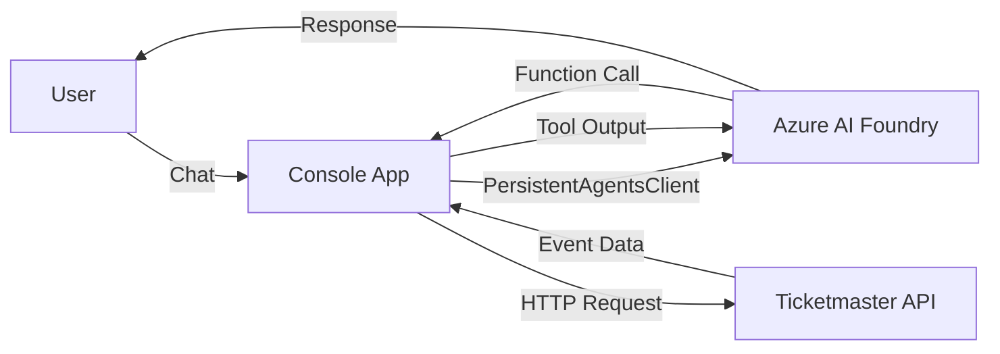

# Concert Concierge

An AI-powered concert assistant built with Azure AI Foundry Agents and Ticketmaster API integration.

## Features

- **Azure AI Foundry Agent Integration**: Leverages GPT-4o model for intelligent conversation
- **Ticketmaster API**: Real-time concert and event information
- **Function Calling**: Agent can search for events using custom tools
- **File Downloads**: Automatically downloads files generated by the agent (e.g., PDFs from code interpreter)
- **Persistent Conversations**: Thread-based chat sessions

## Prerequisites

- .NET 10.0 SDK
- Azure CLI installed and authenticated (`az login`)
- Azure AI Foundry project with deployed GPT-4o model
- Ticketmaster API key (get from [developer.ticketmaster.com](https://developer.ticketmaster.com/))

## Setup

### 1. Configure User Secrets

The application uses .NET user secrets to store sensitive configuration:

```bash
cd ConcertConcierge.Console

# Azure AI Foundry endpoint (format: https://<resource>.services.ai.azure.com/api/projects/<project>)
dotnet user-secrets set "ProjectEndpoint" "YOUR_PROJECT_ENDPOINT"

# Model deployment name (default: gpt-4o)
dotnet user-secrets set "ModelDeploymentName" "gpt-4o"

# Ticketmaster API key
dotnet user-secrets set "TicketMasterApiKey" "YOUR_TICKETMASTER_API_KEY"

# Optional: Reuse an existing agent
dotnet user-secrets set "AgentId" "YOUR_AGENT_ID"
```

### 2. Authenticate with Azure

```bash
az login
```

Make sure you're logged into the same Azure account that has access to your AI Foundry project.

### 3. Build and Run

```bash
dotnet build
dotnet run --project ConcertConcierge.Console
```

## Project Structure

```
ConcertConcierge/
├── ConcertConcierge.Console/         # Main console application
│   └── Program.cs                    # Agent interaction logic
├── ConcertConcierge.TicketMaster/    # Ticketmaster API client library
│   └── TicketMasterClient.cs         # API client and models
└── README.md
```

## How It Works

### Agent Tools

The agent has access to the following tools:

1. **Code Interpreter**: Can write and execute Python code, generate visualizations
2. **Ticketmaster Search**: Search for concerts and events with parameters:
   - `keyword`: Artist name, event name, or venue
   - `city`: City name (e.g., "Seattle", "New York")
   - `stateCode`: US state code (e.g., "WA", "NY")
   - `countryCode`: ISO country code (e.g., "US", "CA")
   - `classificationName`: Event type (e.g., "Music", "Sports")

### Example Queries

- "What concerts are happening in Seattle this month?"
- "Find Taylor Swift concerts in California"
- "Show me rock concerts in New York"
- "Create a calendar of upcoming concerts in my area"

### File Downloads

When the agent generates files (e.g., PDFs, images from code interpreter), they are automatically downloaded to your Downloads folder.

## Architecture



## API Integration

### Ticketmaster Client

The `TicketMasterClient` class provides a clean interface to the Ticketmaster Discovery API:

```csharp
var client = new TicketMasterClient(apiKey);

var events = await client.SearchEventsAsync(
    keyword: "Taylor Swift",
    city: "Seattle",
    stateCode: "WA",
    countryCode: "US"
);
```

Response includes:
- Event name, date, and URL
- Venue information (name, city, state)
- Price ranges
- Links to purchase tickets

## Troubleshooting

### Authentication Issues

- **Error**: "Unauthorized" or tenant mismatch
  - **Solution**: Ensure you're logged into Azure CLI with the correct account: `az account show`

### Agent Not Found

- **Error**: "Agent not found"
  - **Solution**: Either create a new agent (don't set `AgentId` secret) or use a valid existing agent ID

### Ticketmaster API Errors

- **Error**: 401 Unauthorized
  - **Solution**: Check your API key is correctly set in user secrets
  - **Solution**: Verify your API key at developer.ticketmaster.com

### Build Errors

- Ensure you have .NET 10.0 SDK installed: `dotnet --version`
- Clean and rebuild: `dotnet clean && dotnet build`

## Development

### Adding New Tools

To add new function tools for the agent:

1. Define the tool in agent creation:
```csharp
var myTool = new FunctionToolDefinition(
    name: "my_function",
    description: "What this function does",
    parameters: BinaryData.FromString("{...}")
);
```

2. Handle tool execution in the run loop:
```csharp
if (functionToolCall.Name == "my_function")
{
    // Execute your logic
    var result = MyFunction(args);
    toolOutputs.Add(new ToolOutput(functionToolCall.Id, result));
}
```

## License

See [LICENSE](LICENSE) file for details.

## Resources

- [Azure AI Foundry Documentation](https://learn.microsoft.com/en-us/azure/ai-foundry/)
- [Ticketmaster Discovery API](https://developer.ticketmaster.com/products-and-docs/apis/discovery-api/v2/)
- [Azure AI Agents SDK](https://learn.microsoft.com/en-us/dotnet/api/azure.ai.agents.persistent)
